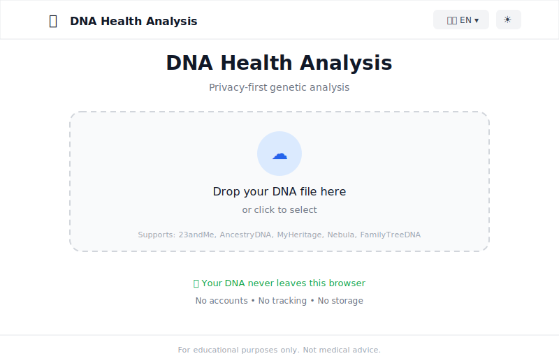

# whatsmydna

Privacy-first genetic health analysis. Your DNA never leaves your browser.

**Live:** [whatsmydna.xyz](https://whatsmydna.xyz)

<p align="center">
  
</p>

## How It Works

```
┌─────────────────────────────────────────────────────────────────┐
│                        YOUR BROWSER                             │
│                                                                 │
│  ┌─────────┐    ┌──────────┐    ┌──────────┐    ┌───────────┐  │
│  │  DNA    │ -> │  Parser  │ -> │ Analyzer │ -> │  Results  │  │
│  │  File   │    │          │    │          │    │           │  │
│  └─────────┘    └──────────┘    └──────────┘    └───────────┘  │
│                                                                 │
│  [SNP Database bundled in app - no network requests]           │
│                                                                 │
└─────────────────────────────────────────────────────────────────┘
                              │
                              ✕ No data leaves
                              │
┌─────────────────────────────────────────────────────────────────┐
│                        INTERNET                                 │
│                                                                 │
│                    (nothing sent here)                          │
│                                                                 │
└─────────────────────────────────────────────────────────────────┘
```

Everything runs locally. The SNP database is bundled with the application. No API calls. No uploads. No tracking.

## Features

- **100% Client-Side** — All analysis runs in your browser
- **20 Languages** — Auto-detect or manual selection
- **50+ Health Markers** — Drug metabolism, methylation, cardiovascular, more
- **Drug Interactions** — Pharmacogenomics warnings (CPIC guidelines)
- **Export** — PDF, Markdown, plain text
- **Destroy Data** — One-click wipe of all results from memory

## Privacy

| Action | Location |
|--------|----------|
| File reading | Browser |
| DNA parsing | Browser |
| SNP analysis | Browser |
| Report generation | Browser |
| PDF export | Browser |

**None of this happens:**
- Server-side processing
- Data upload or transmission
- Analytics or tracking
- External API calls

### Destroy Data

After viewing your results, click "Destroy Data" to immediately clear all genetic information from browser memory. The data exists only in your session and is never persisted.

## Supported Formats

| Source | Format |
|--------|--------|
| 23andMe | TSV (.txt) |
| AncestryDNA | TSV (.txt) |
| MyHeritage | CSV |
| Nebula Genomics | TSV |
| FamilyTreeDNA | CSV |
| VCF files | VCF |

## Quick Start

**Online**

Visit [whatsmydna.xyz](https://whatsmydna.xyz)

**Local**

```bash
git clone https://github.com/oxnr/whatsmydna.git
cd whatsmydna
npm install
npm run dev
```

**For AI Agents**

See [SKILL.md](SKILL.md) for programmatic usage with JSON output.

## Analysis Categories

| Category | Examples |
|----------|----------|
| Drug Metabolism | CYP2C19, CYP2D6, VKORC1 |
| Methylation | MTHFR C677T, MTR, MTRR |
| Neurotransmitters | COMT, BDNF, DRD2 |
| Cardiovascular | APOE, Factor V Leiden |
| Nutrition | Lactose (MCM6), FTO |
| Fitness | ACTN3, ADRB3 |
| Sleep | CLOCK, PER2 |
| Longevity | FOXO3 |

## Tech Stack

- SvelteKit
- TypeScript
- Tailwind CSS
- jsPDF

## Data Sources

- [PharmGKB](https://www.pharmgkb.org/)
- [CPIC](https://cpicpgx.org/)
- [ClinVar](https://www.ncbi.nlm.nih.gov/clinvar/)
- [SNPedia](https://www.snpedia.com/)

## Disclaimer

**For educational purposes only.** Not medical advice. Not a diagnosis. Not a substitute for genetic counseling. Consult healthcare professionals for medical decisions.

## License

MIT

---

Built with [OpenClaw](https://github.com/openclaw/openclaw) + [Claude](https://anthropic.com/claude)
