# whatsmydna

Privacy-first genetic health analysis. Your DNA never leaves your browser.

**Live:** [whatsmydna.xyz](https://whatsmydna.xyz)

<p align="center">
  
</p>

## How It Works



```mermaid
flowchart LR
    subgraph Browser["🔒 Your Browser (100% Local)"]
        A[DNA File] --> B[Parser]
        B --> C{Analyzer}
        
        C --> D[ClinVar\n85K variants]
        C --> E[PharmGKB\n2,840 drugs]
        C --> F[SNP Database\n200+ markers]
        
        D --> G[Results]
        E --> G
        F --> G
        
        G --> H[Export\nPDF/MD/TXT]
    end
    
    I[Internet] -.->|"❌ No data sent"| Browser
```

### Analysis Pipeline

```mermaid
flowchart TB
    subgraph Input["📄 Input"]
        A1[23andMe]
        A2[AncestryDNA]
        A3[MyHeritage]
        A4[Nebula]
        A5[VCF]
    end
    
    subgraph Parse["⚡ Parse"]
        B[Genome Parser\nrsID + Position extraction]
    end
    
    subgraph Analyze["🔬 Analyze"]
        C1[Disease Risk\nClinVar pathogenic variants]
        C2[Drug Response\nPharmGKB interactions]
        C3[Health Markers\nCurated SNP database]
    end
    
    subgraph Output["📊 Results"]
        D1[Health Findings]
        D2[Drug Warnings]
        D3[Disease Markers]
        D4[Export Options]
    end
    
    Input --> Parse --> Analyze --> Output
```



## Features

| Feature | Description |
|---------|-------------|
| 🔒 **100% Client-Side** | All analysis runs in your browser |
| 🧬 **85K Disease Variants** | ClinVar pathogenic/risk variant scanning |
| 💊 **2,840 Drug Interactions** | PharmGKB pharmacogenomics data |
| 🏥 **200+ Health Markers** | Curated SNPs across 17 categories |
| 🌍 **20 Languages** | Auto-detect or manual selection |
| 📄 **Multi-Format Export** | PDF, Markdown, plain text |
| 🗑️ **Destroy Data** | One-click memory wipe |

## Databases


| Database | Entries | Coverage |
|----------|---------|----------|
| **ClinVar** | 85,588 | Pathogenic, likely pathogenic, risk factors |
| **PharmGKB** | 2,840 | Drug-gene interactions with evidence levels |
| **Curated SNPs** | 91 | Drug metabolism, cardiovascular (LPA, PON1), inflammation (IL6R), liver (PNPLA3), nutrition, fitness, cognition, detox |

## Privacy Architecture


**What happens:**
- ✅ File read in browser memory
- ✅ Databases loaded once, cached locally
- ✅ Analysis runs entirely client-side
- ✅ Results stay in browser tab
- ✅ Destroy button clears all data

**What never happens:**
- ❌ DNA data uploaded anywhere
- ❌ Results sent to server
- ❌ Analytics or tracking
- ❌ External API calls during analysis

**Security hardening:**
- CSP blocks all external connections (`connect-src 'self'`)
- Destroy button explicitly clears all cached data from memory
- No cookies, localStorage, or IndexedDB used for genetic data

## Supported Formats

| Source | Format | Auto-Detect |
|--------|--------|-------------|
| 23andMe | TSV (.txt) | ✅ |
| AncestryDNA | TSV (.txt) | ✅ |
| MyHeritage | CSV | ✅ |
| Nebula Genomics | TSV | ✅ |
| FamilyTreeDNA | CSV | ✅ |
| VCF files | VCF | ✅ |
| **Compressed** | .zip, .gz | ✅ |

> 💡 **Tip:** You can drop compressed 23andMe downloads directly — no need to unzip first!

## Quick Start

**Online**
```
https://whatsmydna.xyz
```

**Local Development**
```bash
git clone https://github.com/oxnr/whatsmydna.git
cd whatsmydna
npm install
npm run dev
```

**For AI Agents**
```bash
# See SKILL.md for programmatic JSON API
curl -X POST http://localhost:5173/api/analyze \
  -F "file=@genome.txt"
```

## Analysis Categories

| Category | Key Genes | Clinical Relevance |
|----------|-----------|-------------------|
| **Drug Metabolism** | CYP2C19, CYP2D6, CYP2C9, CYP2A6, VKORC1 | Dosing adjustments |
| **Methylation** | MTHFR, MTR, MTRR, BHMT | Folate metabolism |
| **Cardiovascular** | APOE, F5 (Leiden), F2, LPA | Heart disease, Lp(a) risk |
| **Pharmacogenomics** | SLCO1B1, DPYD, TPMT | Drug toxicity risk |
| **Detox** | PON1, CYP1A2 | Organophosphate/pesticide metabolism |
| **Inflammation** | IL6R, TNF | Inflammatory markers |
| **Liver** | PNPLA3 | NAFLD/fatty liver risk |
| **Neurotransmitters** | COMT, BDNF, DRD2, MAOA | Mental health |
| **Nutrition** | MCM6 (lactose), FTO, TCF7L2, TAS2R38 | Diet, bitter taste |
| **Fitness** | ACTN3, PPARGC1A, ADRB2 | Athletic potential |
| **Sleep** | CLOCK, PER2, ADA | Circadian rhythm |
| **Longevity** | FOXO3, CETP, APOC3 | Aging markers |

## Tech Stack

| Component | Technology |
|-----------|------------|
| Framework | SvelteKit |
| Language | TypeScript |
| Styling | Tailwind CSS |
| PDF Export | jsPDF |
| Testing | Vitest |
| Deployment | Static (Cloudflare Pages) |

## Bundle Size

```
App Code:     ~300KB (gzipped)
ClinVar:      497KB (Brotli)
PharmGKB:     43KB (Brotli)
────────────────────────────
First Load:   ~850KB
```

## Testing

```bash
npm run test      # Run tests
npm run check     # Type check
npm run build     # Production build
```

## Data Sources

- [ClinVar](https://www.ncbi.nlm.nih.gov/clinvar/) — NCBI clinical variant database
- [PharmGKB](https://www.pharmgkb.org/) — Pharmacogenomics knowledge base
- [CPIC](https://cpicpgx.org/) — Clinical pharmacogenetics guidelines
- [SNPedia](https://www.snpedia.com/) — SNP wiki

## How It Works

whatsmydna uses a **three-layer analysis system** that works for ANY DNA file:

### Layer 1: ClinVar Database (85,588 variants)
- Scans for pathogenic, likely pathogenic, and risk variants
- **Auto-explains** findings in plain English using a gene function database
- Covers cancer genes, cardiovascular, neurological, metabolic disorders
- No manual curation needed - works automatically

### Layer 2: PharmGKB (2,840 drug-gene interactions)
- Identifies medications that may need dosing adjustments
- **Auto-explains** drug interactions with evidence levels
- Covers warfarin, statins, antidepressants, chemotherapy, and more
- Follows CPIC clinical guidelines

### Layer 3: Curated SNPs (114 markers)
- Hand-written explanations for common health/lifestyle markers
- Premium quality explanations with actionable advice
- Covers: caffeine, lactose, COMT, ACTN3, FTO, APOE, MTHFR, etc.
- Community-contributed via pull requests

**Result:** Any DNA file gets useful results. Rare variants get auto-generated explanations. Common variants get premium curated explanations.

## Development

To contribute curated markers, add entries to `src/lib/analysis/comprehensiveSnpDatabase.ts`.
To improve auto-explanations, edit `src/lib/analysis/autoExplainer.ts`.

## Disclaimer

⚠️ **For educational purposes only.**

- Not medical advice
- Not a clinical diagnosis
- Not a substitute for genetic counseling
- Consult healthcare professionals for medical decisions

## License

MIT

---

Built with [OpenClaw](https://github.com/openclaw/openclaw) + [Claude](https://anthropic.com/claude)
