# whatsmydna

Privacy-first genetic health analysis. Your DNA never leaves your browser.

**Live:** [whatsmydna.xyz](https://whatsmydna.xyz)

<p align="center">
  
</p>

## How It Works


### Analysis Pipeline

```mermaid
flowchart TB
    subgraph Input["📄 Input"]
        A1[23andMe]
        A2[AncestryDNA]
        A3[MyHeritage]
        A4[Nebula]
        A5[VCF]
    end
    
    subgraph Parse["⚡ Parse"]
        B[Genome Parser\nrsID + Position extraction]
    end
    
    subgraph Analyze["🔬 Analyze"]
        C1[Disease Risk\nClinVar pathogenic variants]
        C2[Drug Response\nPharmGKB interactions]
        C3[Health Markers\nCurated SNP database]
    end
    
    subgraph Output["📊 Results"]
        D1[Health Findings]
        D2[Drug Warnings]
        D3[Disease Markers]
        D4[Export Options]
    end
    
    Input --> Parse --> Analyze --> Output
```



## Features

| Feature | Description |
|---------|-------------|
| 🔒 **100% Client-Side** | All analysis runs in your browser |
| 🧬 **85K Disease Variants** | ClinVar pathogenic/risk variant scanning |
| 💊 **2,840 Drug Interactions** | PharmGKB pharmacogenomics data |
| 🏥 **200+ Health Markers** | Curated SNPs across 17 categories |
| 🌍 **20 Languages** | Auto-detect or manual selection |
| 📄 **Multi-Format Export** | PDF, Markdown, plain text |
| 🗑️ **Destroy Data** | One-click memory wipe |

## Databases


| Database | Entries | Coverage |
|----------|---------|----------|
| **ClinVar** | 85,588 | Pathogenic, likely pathogenic, risk factors |
| **PharmGKB** | 2,840 | Drug-gene interactions with evidence levels |
| **Comprehensive SNPs** | 200+ | Drug metabolism, methylation, fitness, nutrition, sleep, cardiovascular, cognition, longevity |

## Privacy Architecture


**What happens:**
- ✅ File read in browser memory
- ✅ Databases loaded once, cached locally
- ✅ Analysis runs entirely client-side
- ✅ Results stay in browser tab
- ✅ Destroy button clears all data

**What never happens:**
- ❌ DNA data uploaded anywhere
- ❌ Results sent to server
- ❌ Analytics or tracking
- ❌ External API calls during analysis

## Supported Formats

| Source | Format | Auto-Detect |
|--------|--------|-------------|
| 23andMe | TSV (.txt) | ✅ |
| AncestryDNA | TSV (.txt) | ✅ |
| MyHeritage | CSV | ✅ |
| Nebula Genomics | TSV | ✅ |
| FamilyTreeDNA | CSV | ✅ |
| VCF files | VCF | ✅ |

## Quick Start

**Online**
```
https://whatsmydna.xyz
```

**Local Development**
```bash
git clone https://github.com/oxnr/whatsmydna.git
cd whatsmydna
npm install
npm run dev
```

**For AI Agents**
```bash
# See SKILL.md for programmatic JSON API
curl -X POST http://localhost:5173/api/analyze \
  -F "file=@genome.txt"
```

## Analysis Categories

| Category | Key Genes | Clinical Relevance |
|----------|-----------|-------------------|
| **Drug Metabolism** | CYP2C19, CYP2D6, CYP3A5, VKORC1 | Dosing adjustments |
| **Methylation** | MTHFR, MTR, MTRR, BHMT | Folate metabolism |
| **Cardiovascular** | APOE, F5 (Leiden), F2 | Heart disease risk |
| **Pharmacogenomics** | SLCO1B1, DPYD, TPMT | Drug toxicity risk |
| **Neurotransmitters** | COMT, BDNF, DRD2, MAOA | Mental health |
| **Nutrition** | MCM6 (lactose), FTO, TCF7L2 | Diet optimization |
| **Fitness** | ACTN3, PPARGC1A, ADRB2 | Athletic potential |
| **Sleep** | CLOCK, PER2, ADA | Circadian rhythm |
| **Longevity** | FOXO3, CETP, APOC3 | Aging markers |

## Tech Stack

| Component | Technology |
|-----------|------------|
| Framework | SvelteKit |
| Language | TypeScript |
| Styling | Tailwind CSS |
| PDF Export | jsPDF |
| Testing | Vitest |
| Deployment | Static (Cloudflare Pages) |

## Bundle Size

```
App Code:     ~300KB (gzipped)
ClinVar:      497KB (Brotli)
PharmGKB:     43KB (Brotli)
────────────────────────────
First Load:   ~850KB
```

## Testing

```bash
npm run test      # Run tests
npm run check     # Type check
npm run build     # Production build
```

## Data Sources

- [ClinVar](https://www.ncbi.nlm.nih.gov/clinvar/) — NCBI clinical variant database
- [PharmGKB](https://www.pharmgkb.org/) — Pharmacogenomics knowledge base
- [CPIC](https://cpicpgx.org/) — Clinical pharmacogenetics guidelines
- [SNPedia](https://www.snpedia.com/) — SNP wiki

## Disclaimer

⚠️ **For educational purposes only.**

- Not medical advice
- Not a clinical diagnosis
- Not a substitute for genetic counseling
- Consult healthcare professionals for medical decisions

## License

MIT

---

Built with [OpenClaw](https://github.com/openclaw/openclaw) + [Claude](https://anthropic.com/claude)
